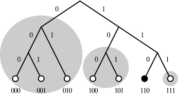

.. Kademlia documentation master file, created by
   sphinx-quickstart on Wed Sep 25 00:56:19 2019.
   You can adapt this file completely to your liking, but it should at least
   contain the root `toctree` directive.

Introduction
============

What is DHT?
^^^^^^^^^^^^

在解釋Kademlia前先說說DHT的概念，DHT為\ **distributed hash
table**\ (分散式雜湊表)的縮寫，概念上來說，每筆**data**\ 都有對應的\ **key**\ ，只要給定\ **key**\ 就能從網路上取得\ **data**\ 。

.. figure:: _static/Dht_en.svg
   :alt: 

應用在這專案中(P2PLending)來解釋，只要有ID，就能找到對應的借貸資料，或是另一位peer

What is Kademlia?
^^^^^^^^^^^^^^^^^

Kademlia是一種DHT演算法，將peer與檔案視為同構，也就是說檔案ID與peer
ID可以相同，而演萬法上也會把檔案存在相同ID的peer上。

How Kademlia work?
^^^^^^^^^^^^^^^^^^

Kademlia將整個系統映射至二元樹上，所有ID都是一組只有0或1的bit字串，0為左子樹，1為右子樹。以下先解釋幾個概念

XOR距離運算
'''''''''''

任意兩ID進行XOR運算結果定義為彼此的距離

Kbucket
'''''''

對於任何一個節點來說，由root開始算，將\ **不包含**\ 自己的子樹劃分出來即為一個Kbucket，\ **K**\ 代表這bucket最多會存著\ **K**\ 個節點。只要所有Kbucket都至少存有一個節點，該節點就可以遍歷整個網路

路由機制
''''''''

| 為甚麼這樣就能遍歷網路？
| 由於Kbucket是拆分出來的子樹，同bucket內的節點前綴會相同，當今天把資料送給某個位置未知的節點X時，只要把資料交給同Kbucket內的節點Y，這樣等於把距離收斂至bucket內，節點Y再以自己的視角找尋bucket內的其他節點，就能將距離收斂至找到目標。

.. figure:: _static/Kad-routing.png
   :alt: 

Getting start
^^^^^^^^^^^^^

所有資料傳輸都遵循以下規則:

| * 任何資料轉手次數只要>=8就會直接丟棄，不進行處理
| * 資料絕不回傳給已經手過的節點
| * 當一個節點接收到任一節點的資料，就會將對方加入自己的KBucket

Kademlia initial
''''''''''''''''

自己一人是無法構成網路的，想要拓展自己的網路就要先update一個已知節點的資料，向對方發出GET
node
SelfID請求，也就是請對方找\ **自己**\ ，Kademlia節點只要收到任何請求都會先將對方update進自己的bucket然後才執行其他動作，當收到GET
node
SelfID的請求時，對方就會將自己加入bucket中，然後回傳對方bucket中離自己最近的其他節點，再向這些節點發出請求，如此遞迴下去，就能完備自己的bucket資料

update
''''''

跟新一個節點到自己的bucket內，如果bucket已到達上限\ **K**\ ，就會檢查最舊的節點有無響應(ping他)，如果有，就把該節點移到最前面(視為最新)，並捨棄新加入的節點，否則就刪除舊節點加入新節點。

LookUp
''''''

當執行LookUp會看自己的bucket內有無該節點，有就直接回傳，否則會開始依參數\ **a**\ 分\ **a**\ 個thread下去調度同bucket內的其他節點發出GET
node請求，其他節點收到請求後，如果自己存有該節點資料就會直接回傳，否則會回傳\ **K**\ 個最接近的節點

UpLoad
''''''

上傳的檔案會先將內容進行Hash，所得到的Hash code即為目標節點，將檔案送往目標節點，途經的各點都會將檔案存於本地，並往下遞迴執行UpLoad，同時將送下去的節點資訊回傳給最初呼叫UpLoad的節點，如果送往目標後，目標節點匯兌最靠近自己的K個節點執行UpLoad

DownLoad
''''''''

當你有一段Hash code，就能往目標節點執行Get file，途中經過的節點如果存有該檔案，就會直接回傳檔案，否則就繼續執行Get file，同時將送下去的節點資訊回傳給最初呼叫Get File的節點

.. toctree::
   :maxdepth: 2
   :caption: Contents:
   
   crypto
   handler
   network
   node
   util

Indices and tables
==================

* :ref:`genindex`
* :ref:`modindex`
* :ref:`search`
